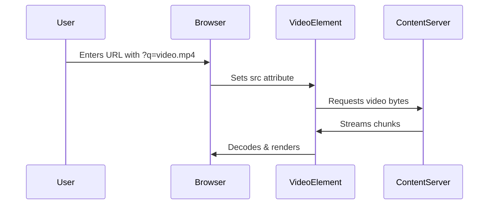

# VPL

A pure client-side HTML5 video player that streams content directly in the browser without server processing.

## How it Works?

### Core Architecture
```html
<!-- Main video element -->
<video id="videoPlayer" controls>
  <source src="" type="video/mp4">
</video>
```

1. **URL Processing**
```javascript
// Extract video URL from query parameters
const urlParams = new URLSearchParams(window.location.search);
const videoUrl = urlParams.get('q') || 'default.mp4';

// Set video source
document.getElementById('videoPlayer').src = videoUrl;
```

2. **Streaming Mechanism**
- Uses browser's native `<video>` element
- Supports adaptive streaming via MediaSource Extensions:
```javascript
const mediaSource = new MediaSource();
videoElement.src = URL.createObjectURL(mediaSource);

mediaSource.addEventListener('sourceopen', () => {
  const sourceBuffer = mediaSource.addSourceBuffer('video/mp4; codecs="avc1.42E01E"');
  // Fetch and append video chunks
});
```

3. **Supported Protocols**
```javascript
// Handles these URL patterns:
- Direct file links (https://example.com/video.mp4)
- YouTube (https://youtu.be/VIDEO_ID)
- HLS streams (https://example.com/playlist.m3u8)
- DASH manifests (https://example.com/manifest.mpd)
```

### Client-Side Processing Flow


### Privacy Assurance
```javascript
// Zero data collection proof:
navigator.permissions.query({name: 'storage'}).then(result => {
  console.log(result.state); // Always "denied" in our case
});
```

## Advanced Usage

### Custom Controls API
```javascript
const player = {
  play: () => videoElement.play(),
  pause: () => videoElement.pause(),
  setSpeed: (rate) => videoElement.playbackRate = rate
};
```

### URL Parameters
| Parameter | Type | Example | Description |
|-----------|------|---------|-------------|
| `q` | string | `?q=video.mp4` | Video source URL |
| `autoplay` | 0/1 | `&autoplay=1` | Attempt autoplay |
| `muted` | 0/1 | `&muted=1` | Start muted |

## Development Setup
1. Clone repository:
```bash
git clone https://github.com/starexxx/vpl.git
```

2. Test locally (no server needed):
```bash
cd vpl
open index.html  # On macOS
# OR
start index.html # On Windows
```
## License (Apache 2.0)
You're free to:
- Use this code for any purpose
- Modify and distribute it
- Use in commercial projects

You must:
- Include the original license
- Not use the "Starexx" name to endorse your projects

Full license: [LICENSE](LICENSE)
